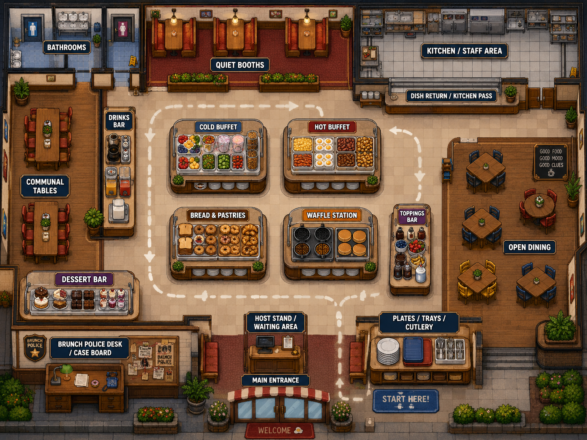

# Brunch Area Concept

## Recommended concept: The Brunch Circuit

Use a large, open restaurant built around a central self-serve buffet.  

Customers enter, 
collect a plate, 
move between food stations, 
find a table, 
return for additional items, 
and eventually bring dishes to the return counter. 

The player can patrol both around and through this circulation loop 
without being trapped behind NPC queues.

---

## Top-down floor plan

<div align="center">

<table>
  <tr>
    <td>
        <pre>
┌────────────────────────────── NORTH ─────────────────────────────┐
│                                                                  │
│  ┌─────────────┐  ┌─────────────────┐  ┌──────────────────────┐  │
│  │ BATHROOMS   │  │  QUIET BOOTHS   │  │ KITCHEN / STAFF AREA │  │
│  │             │  │  2-4 seats each │  │                      │  │
│  │ Pipe-Level  │  │                 │  │ Kitchen-Level Exit   │  │
│  │ Chase Exit  │  └─────────────────┘  └──────────┬───────────┘  │
│  └──────┬──────┘                                  │              │
│         │                               ┌─────────▼────────────┐ │
│  ┌──────▼──────┐                        │ DISH RETURN /        │ │
│  │ DRINKS BAR  │                        │ KITCHEN PASS         │ │
│  │ Coffee      │                        └──────────────────────┘ │
│  │ Juice       │                                                 │
│  │ Milk        │   ┌──────────────────┐  ┌──────────────────┐    │
│  └─────────────┘   │ COLD BUFFET      │  │ HOT BUFFET       │    │
│                    │ Fruit, yogurt,   │  │ Eggs, bacon,     │    │
│  ┌─────────────┐   │ cereal, salads   │  │ sausage, potato  │    │
│  │ COMMUNAL    │   └──────────────────┘  └──────────────────┘    │
│  │ TABLES      │                                                 │
│  │             │        ↻ CUSTOMER BUFFET CIRCULATION ↻          │
│  └─────────────┘   ┌──────────────────┐  ┌──────────────────┐    │
│                    │ BREAD & PASTRIES │  │ WAFFLE / PANCAKE │    │
│                    │ Toast, bagels,   │  │ STATION          │    │
│                    │ croissants       │  │ Interactive      │    │
│                    └──────────────────┘  └──────────────────┘    │
│                                                                  │
│  ┌─────────────┐   ┌──────────────────┐  ┌──────────────────┐    │
│  │ DESSERT BAR │   │ TOPPINGS BAR     │  │ OPEN DINING      │    │
│  │ Cakes and   │   │ Syrup, sauces,   │  │ Movable tables   │    │
│  │ sweets      │   │ fruit, whipped   │  │ and mixed NPCs   │    │
│  └─────────────┘   └──────────────────┘  └──────────────────┘    │
│                                                                  │
│  ┌──────────────────┐       ┌───────────────────────────────┐    │
│  │ BRUNCH POLICE    │       │ PLATES, TRAYS, CUTLERY        │    │
│  │ DESK / CASE BOARD│       │ Start of self-serve route     │    │
│  └──────────────────┘       └───────────────────────────────┘    │
│                                                                  │
│                 HOST STAND / WAITING AREA                        │
│                                                                  │
│              MAIN ENTRANCE / STREET-LEVEL EXIT                   │
└────────────────────────────── SOUTH ─────────────────────────────┘
        </pre>
    </td>
  </tr>
  <tr>
    <td>
      
    </td>
  </tr>
</table>

</div>

---

## Customer route

The standard customer routine should be:

Entrance → plate station → food stations → drinks → seating → optional refill → dish return → exit

Customers should not all follow an identical route.  

Give each NPC a preference profile:
- Some immediately visit the hot buffet.
- Some begin with pastries or fruit.
- Some repeatedly return for bacon.
- Some visit the dessert station before eating.
- Some collect drinks for an entire table.
- Suspicious customers may skip the plate station, conceal food, 
  exchange plates, enter staff areas, or repeatedly visit one station.

This creates natural movement while making unusual behaviour recognizable.

---

## Buffet organization

Avoid constructing one long cafeteria line. 
It would create congestion and restrict the player’s movement. 

Instead, use four central islands accessible from multiple sides:
1. Cold buffet.
2. Hot breakfast buffet.
3. Bread and pastry station.
4. Pancake and waffle station.

The toppings bar can sit below the waffle station 
because the two systems are related, 
but it should also remain accessible from the general dining area. 

Drinks and desserts should be separate from the main buffet loop 
so customers produce varied routes.

Leave at least:
- Three walkable tiles between ordinary furniture.
- Four tiles around major buffet islands.
- Five tiles along the primary patrol loop.
- Two different approaches to every major station.

---

## Seating zones

Divide seating into visually and behaviourally distinct areas.

**Quiet booths:** 
Couples, families, cautious suspects and dialogue-heavy NPCs. 
Booths create semi-private inspection scenes.

**Communal tables:** 
Larger groups, food sharing, plate swapping and conflicting witness statements.

**Open dining:** 
Highly visible tables where the player can easily 
compare plates and observe NPC routines.

A small optional patio could later replace part of the open dining area, 
but the first version should remain indoors and compact.

---

## Investigation placement

The player’s desk should be near the entrance but outside the customer route. 

It can contain:
- Current case information.
- Suspect portraits.
- Collected evidence.
- Tutorial instructions.
- Level progress.
- A radio or dispatcher.
- A map showing unlocked chase areas.

This supports the project’s objective system, 
which can track active, completed and failed objectives 
and update them through dialogue or player actions.

The player should have a complete patrol loop:
```
Police Desk
    ↓
Plate Station
    ↓
Central Buffet
    ↓
Kitchen Pass
    ↓
Booths and Bathrooms
    ↓
Drinks and Communal Tables
    ↓
Dessert Bar and Open Dining
    ↓
Police Desk
```

Add two cross-aisles through the central buffet 
so the player can interrupt the loop 
rather than walking around the entire restaurant.

---

## Chase exits

The three level-transition exits should be immediately readable 
but positioned on different sides of the hub:
- **Main entrance, south:** Street and alley chase levels.
- **Bathrooms, northwest:** Pipe, sewer or plumbing levels.
- **Kitchen door, northeast:** Kitchen and staff-only levels.

A fleeing culprit can run from the central restaurant floor toward any exit. 
Each route should be long enough for a short escape animation 
but should not require complicated navigation.

Use different visual signals:
- Main entrance: sunlight, street signs and swinging doors.
- Bathroom: tiled hallway and restroom sign.
- Kitchen: stainless-steel doors, steam and warning stripes.

---

## Suggested prototype scale

A practical first version would use approximately **56 × 38 walkable tiles**, 
divided as follows:

| Area                              | Approximate share |
| --------------------------------- | ----------------: |
| Central buffet and circulation    |               30% |
| Seating                           |               35% |
| Kitchen and service spaces        |               15% |
| Entrance and police desk          |               10% |
| Bathrooms and secondary corridors |               10% |

Start with approximately 12 dining tables, 6 booths and 18–24 active customers.  
Additional tables can exist visually without being fully interactive.

The central buffet should remain the visual and mechanical focus.   
From most positions, the player should be able to see at least 
two food stations, several customers and one major exit.

---


