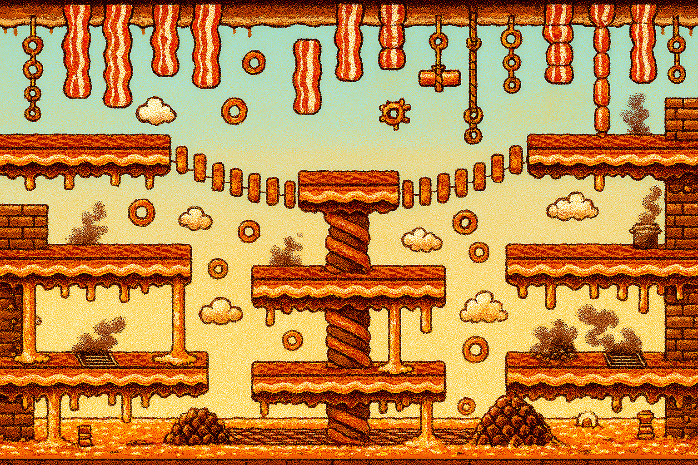
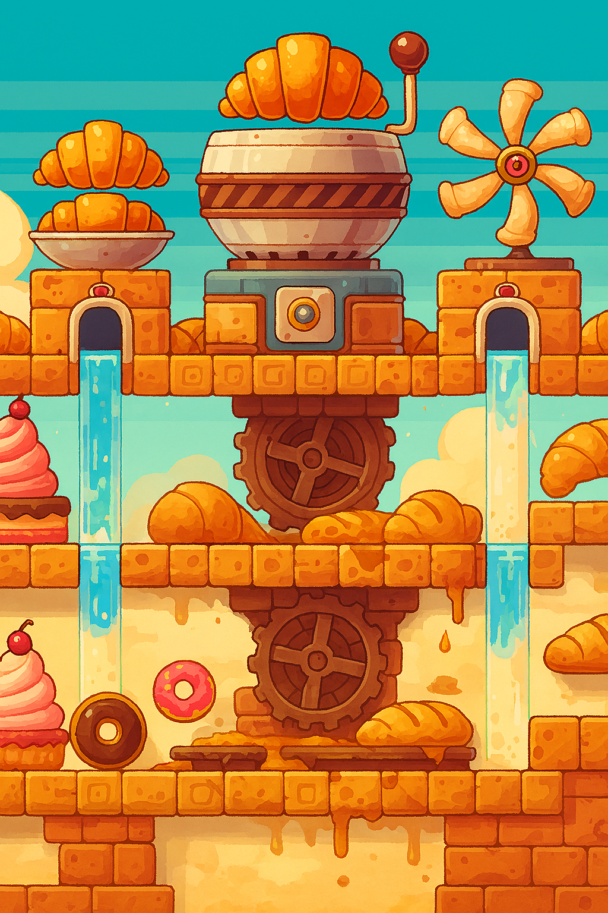
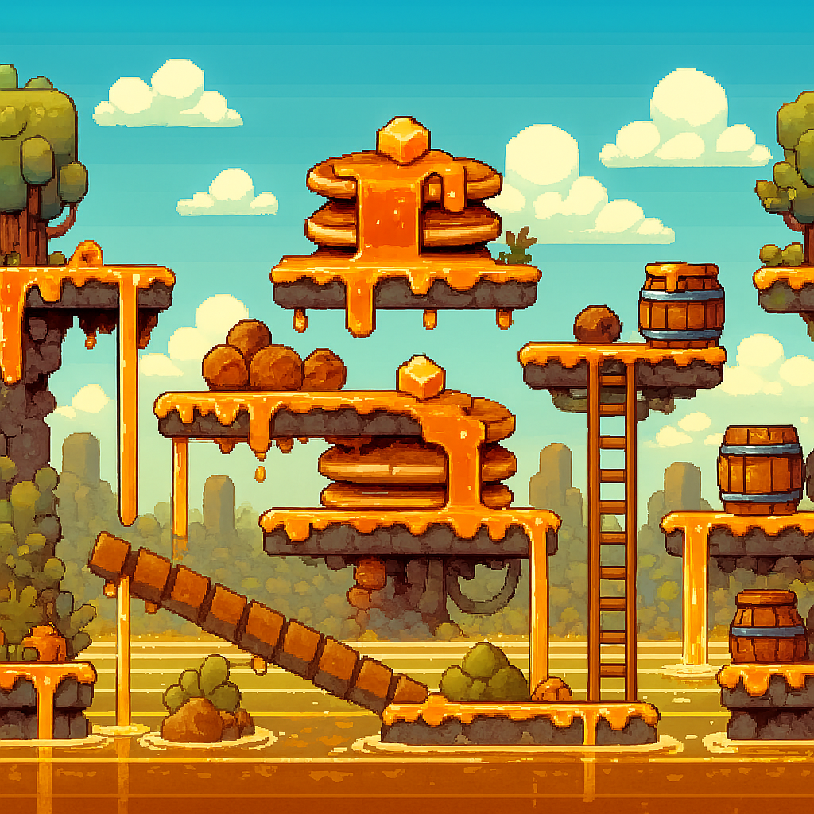
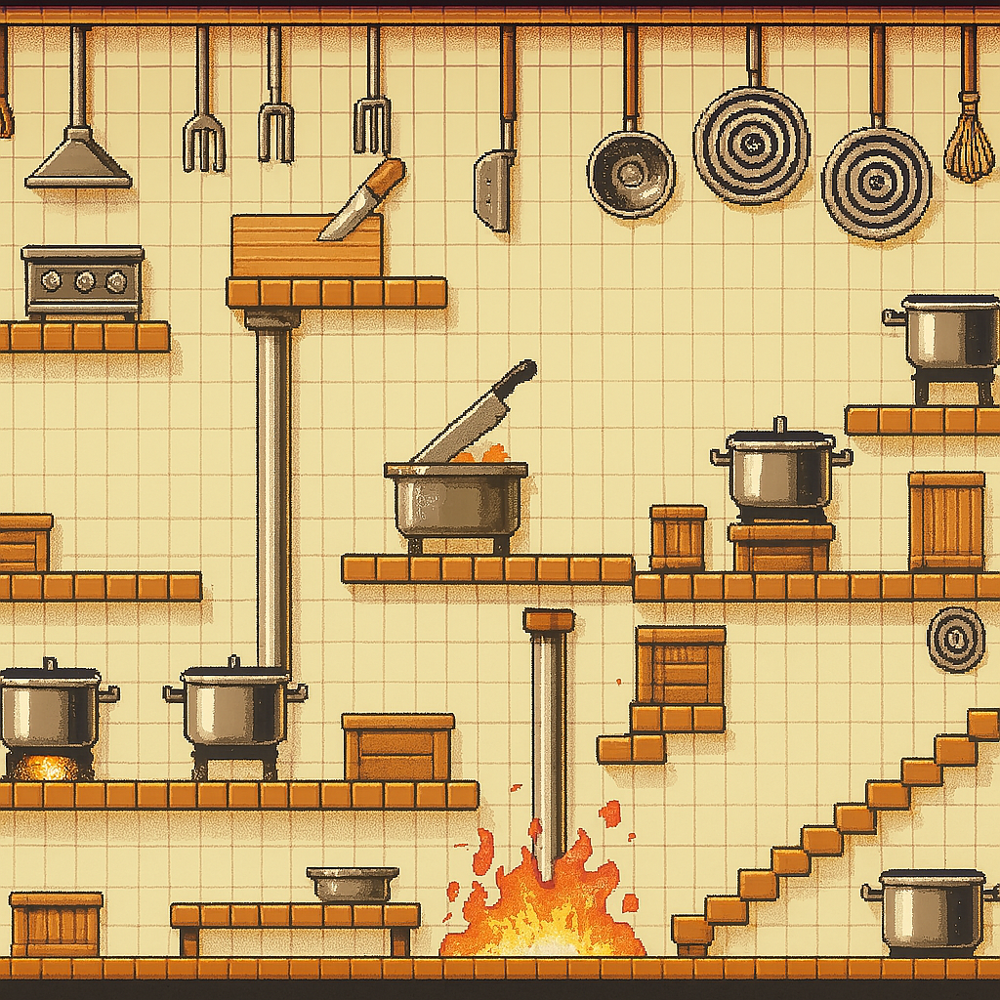
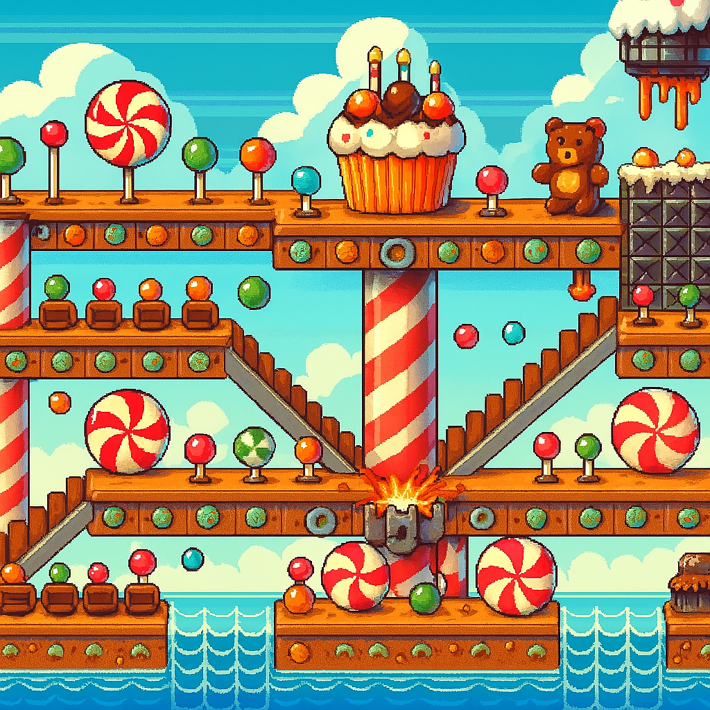
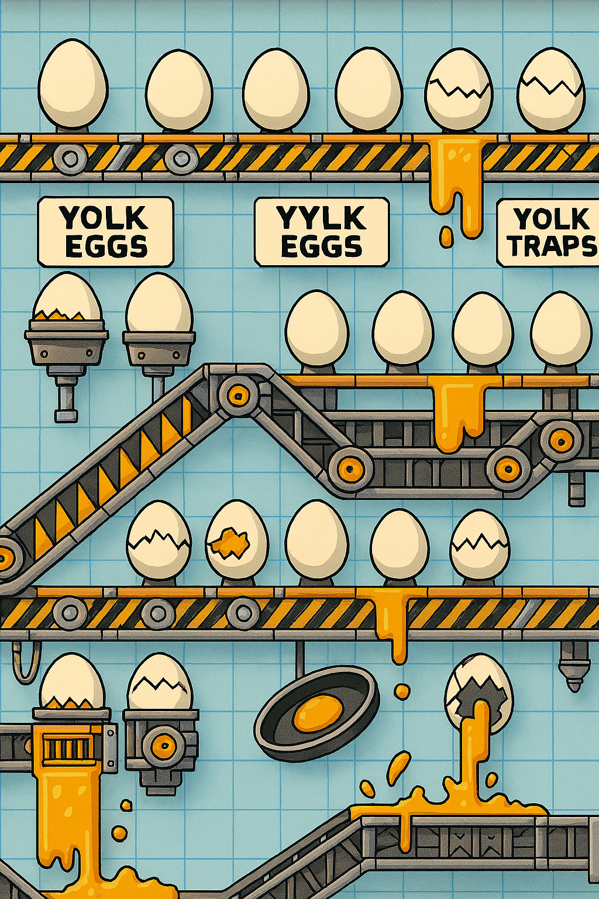
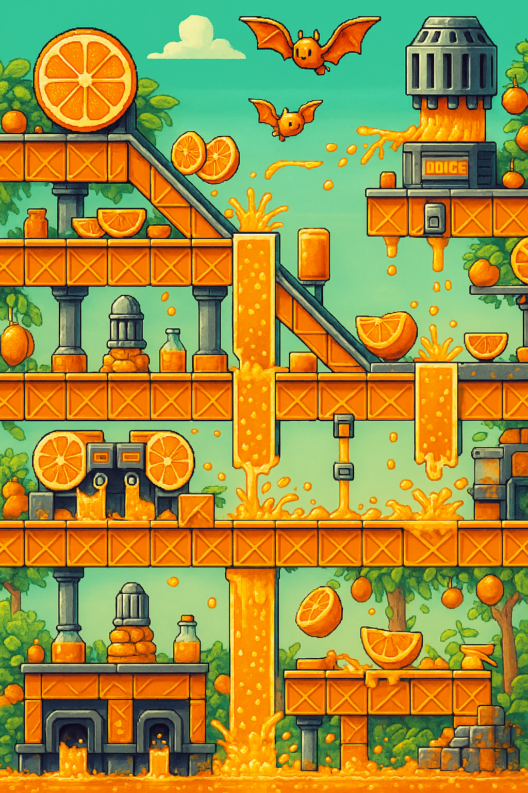
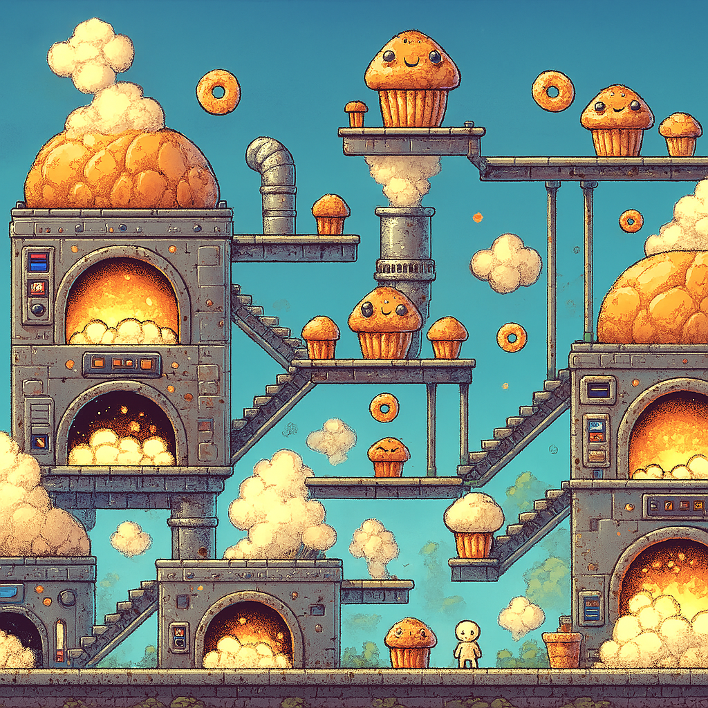

# Character and level design

Here are some ideas for culprits, each with their unique 
level theme, design, and gameplay details.

---

## Grease Canyon - Bacon Bandit

| Level   | Grease Canyon                   |
| ------- | ------------------------------- |
| Culprit | "Bacon Bandit"                  |
| Name    | Barry “Bacon Bandit” Brown      |
| Crime   | Takes an entire plate of bacon. |

### Grease Canyon

#### **Level Elements**:
Platforms made of sizzling bacon strips.  
Pits of boiling grease bubbling below.  
Ropes made of hanging sausage links.  

#### **Background**:
Details like sizzling griddles or fat clouds

#### **Color Palette**:
Warm reds, oranges, golds, with breakfast-food textures

#### **Enemies**:
Small angry pigs trying to knock you off platforms.  
Worm-like bacon strips moving up and down ropes.  
Flying sausage links that swoop down at you.

#### **Boss Fight**:
Barry uses a "Bacon Tornado" attack, 
spinning wildly with bacon flying everywhere.  

Avoid his attacks by jumping between platforms 
and hitting him with your Bacon Gun when he slows down.

#### **Power-ups**:
Grease Slide: Dash to avoid the tornado.  
Extra Bacon: Absorbs a hit from the flying bacon debris.

#### **Evidence to Collect**:
Bacon Strips

---

## Pastry Palace - Croissant Crook

| Level   | Pastry Palace                     |
| ------- | --------------------------------- |
| Culprit | "Croissant Crook"                 |
| Name    | Clara “Croissant Crook” Cline     |
| Crime   | Sneaks croissants into her purse. |

### Pastry Palace

#### **Level Elements**:
Platforms made of stacked croissants, baguettes, and cakes.  
Giant dough mixers that spin like rotating hazards.  
Sticky syrup puddles slow your movement.  

#### **Background**:

#### **Color Palette**:

#### **Enemies**:
Flying éclairs shooting whipped cream projectiles.  
Rolling baguette enemies.  
Jelly-filled donuts that explode on contact.  

#### **Boss Fight**:
Clara throws oversized croissants that stick to the ground, blocking movement.  
She dashes around the arena, dodging attacks.  

Use Syrup Boots to move through sticky areas and hit her when she's throwing croissants.  

#### **Power-ups**:
Syrup Trail: Creates a sticky path to slow down enemies.  
Whipped Cream Shield: Absorbs one hit.  

#### **Evidence to Collect**:

---

## Sticky Syrup Swamp - Syrup Scoundrel

| Level   | Sticky Syrup Swamp                             |
| ------- | ---------------------------------------------- |
| Culprit | “Syrup Scoundrel”                              |
| Name    | Simon “Syrup Scoundrel” Sugars                 |
| Crime   | Dumps syrup all over the buffet, ruining food. |

### Sticky Syrup Swamp

#### **Level Elements**:
Slippery platforms coated in syrup.  
Syrup waterfalls create vertical traversal challenges.  
Floating pancake rafts move slowly across syrup lakes.  

#### **Background**:

#### **Color Palette**:

#### **Enemies**:
Angry bees buzzing around, protecting syrup sources.  
Syrup golems that emerge from the sticky floor.  
Flying butter pats that zoom across the screen.  

#### **Boss Fight**:
Simon uses a syrup cannon to cover parts of the arena.  

Avoid the syrup pools and attack him when he's reloading.  

#### **Power-ups**:
Butter Boots: Prevent slipping on syrupy platforms.  
Honey Comb: Attracts bees, distracting them from attacking you.  

#### **Evidence to Collect**:

---

## Kitchen Mayhem - Cutlery Thief

| Level   | Kitchen Mayhem                    |
| ------- | --------------------------------- |
| Culprit | "Cutlery Thief"                   |
| Name    | Carl “Cutlery Carl” Canes         |
| Crime   | Steals forks, spoons, and knives. |

### Kitchen Mayhem

#### **Level Elements**:
Navigate the chaotic back kitchen.  
Avoid hazards like falling knives, boiling pots, and flying rolling pins.  
Platforms made of cutting boards and countertops.  

#### **Background**:

#### **Color Palette**:

#### **Enemies**:
Knife-throwing chefs.  
Dishwashing sponges that leap at you.  
Spinning ladle enemies.  

#### **Boss Fight**:
Carl throws stolen cutlery at you while hiding behind piles of dishes.  

Break the dishes to expose him and attack while dodging flying cutlery.  

#### **Power-ups**:
Dish Soap Speed Boost: Temporarily increases your movement speed.  
Shield of Cutlery: Reflects flying knives and projectiles.  

#### **Evidence to Collect**:
Cutlery

---

## Candy Chaos - Dessert Hoarder

| Level   | Candy Chaos                            |
| ------- | -------------------------------------- |
| Culprit | "Dessert Hoarder"                      |
| Name    | Debbie “Dessert Hoarder” Sweet         |
| Crime   | Hoards all the desserts at the buffet. |

### Candy Chaos

#### **Level Elements**:
Candy cane bridges and chocolate lava rivers.  
Gumdrop trampolines that launch you to higher platforms.  
Rolling peppermint wheels act as hazards.  

#### **Background**:

#### **Color Palette**:

#### **Enemies**:
Gummy bear brutes that charge at you.  
Cupcake bombs that explode into frosting.  
Jellybean snipers shooting candy projectiles.  

#### **Boss Fight**:
Debbie rides a giant rolling cake, throwing explosive candy at you.  

Knock her off the cake by jumping on switches that activate sprinklers to wash the cake away.  

#### **Power-ups**:
Frosting Barrier: Shields you from candy projectiles.  
Sugar Rush: Temporarily doubles your attack speed.  

#### **Evidence to Collect**:

---

## Egg Factory Frenzy - Omelet Overlord

| Level   | Egg Factory Frenzy                         |
| ------- | ------------------------------------------ |
| Culprit | “Omelet Overlord”                          |
| Name    | Oliver “Omelet Overlord” Eggman            |
| Crime   | Takes all the eggs to make a giant omelet. |

### Egg Factory Frenzy

#### **Level Elements**:
Conveyor belts transporting giant eggs.  
Platforms shaped like frying pans and egg cartons.  
Hazards like cracking eggs that spill yolk traps.  

#### **Background**:

#### **Color Palette**:

#### **Enemies**:
Angry chickens chasing you.  
Eggshell drones that drop yolk bombs.  
Frying pans that slam down on platforms.  

#### **Boss Fight**:
Oliver uses a spatula to flip you off platforms.  

Avoid his attacks and use the Egg Launcher (special level weapon) to crack his defenses.  

#### **Power-ups**:
Omelet Shield: Absorbs one hit.  
Egg Timer: Slows down enemies temporarily.  

#### **Evidence to Collect**:

---

## Citrus Cascade - Juice Jacker

| Level   | Citrus Cascade                         |
| ------- | -------------------------------------- |
| Culprit | "Juice Jacker"                         |
| Name    | Julie “Juice Jacker” Squeeze           |
| Crime   | Steals all the orange juice in bottles |

### Citrus Cascade

#### **Level Elements**:
Platforms made of citrus wedges and orange slices.  
Streams of orange juice act as slippery hazards.  
Soda fountains spraying juice act as launchers.  

#### **Background**:

#### **Color Palette**:

#### **Enemies**:
Squeezing machines that spit out juice jets.  
Lemon bats that swoop down to attack.  
Orange peel traps that roll across the ground.  

#### **Boss Fight**:
Julie uses a juicer gun to spray juice at you.  

Dodge the streams and attack her when she pauses to reload.  

#### **Power-ups**:
Vitamin Boost: Heals a small amount of health.  
Citrus Blast: Fires an orange grenade that explodes into sticky pulp.  

#### **Evidence to Collect**:

---

## Bakery Bonanza - Muffin Mastermind

| Level   | Bakery Bonanza                                |
| ------- | --------------------------------------------- |
| Culprit | “Muffin Mastermind”                           |
| Name    | Marty “Muffin Mastermind” Munch               |
| Crime   | Hides muffins in his hat to smuggle them out. |

### Bakery Bonanza

#### **Level Elements**:
Giant ovens with conveyor belts.  
Rising dough platforms that expand and collapse.  
Hazards like flour clouds that obscure visibility.  

#### **Background**:

#### **Color Palette**:

#### **Enemies**:
Flour bag monsters puffing clouds of flour.  
Rolling muffin trays acting as moving hazards.  
Burning muffins that charge at you.  

#### **Boss Fight**:
Marty throws explosive muffins while hiding behind piles of baking trays.  

Clear the trays to expose him and attack.  

#### **Power-ups**:
Oven Mitts: Protects against hot hazards.  
Muffin Shield: Blocks one projectile.  

#### **Evidence to Collect**:

---

## Other Ideas

- Back Alley - Garbage bins/Street Theme
  - Culprit smuggling food in closed containers in trash to retrieve later  
  - trash can parkour

- Street/Alley/Road Levels:
  - Enemies: Small angry pigs, dodging traffic, food trucks.
  - Hazards: Slippery oil spills, falling food debris.
  - Power-ups: Bacon grease slide, syrup stickiness (temporary wall climbing).

- Toilet/Pipes Levels:
  - Enemies: Germ monsters, toilet paper snakes.
  - Hazards: Overflowing toilets, gushing water pipes.
  - Power-ups: Plunger jump, sanitizer spray (clears enemies).

- Kitchen Levels:
  - Enemies: Angry chefs, rolling pins, knife-throwing sous chefs.
  - Hazards: Hot stoves, falling pots and pans.
  - Power-ups: Shield of Cutlery, Dish Soap Speed Boost.

